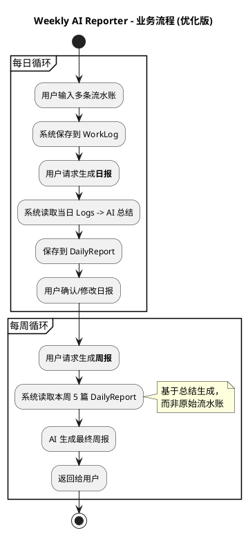
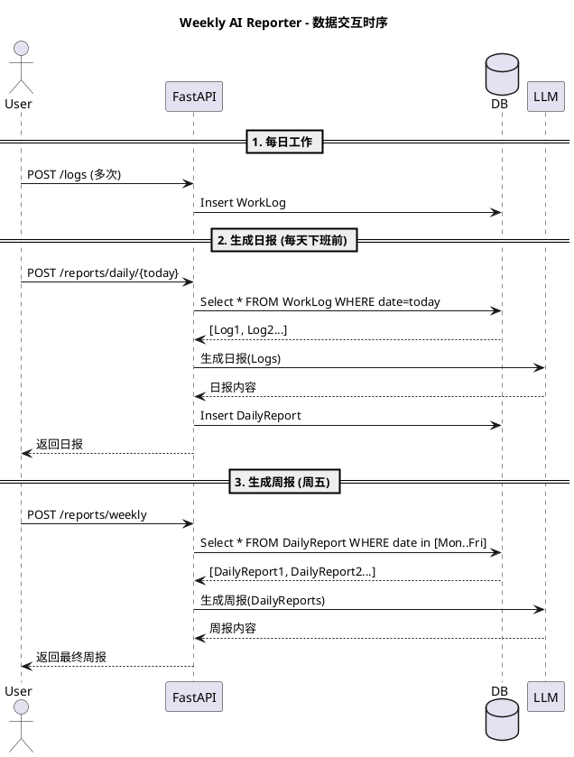

# Weekly AI Reporter - MVP Design Document

## 2. 技术架构

- **编程语言**: Python 3.10+
- **Web 框架**: FastAPI
- **数据库**: SQLite (配合 SQLModel ORM)
- **AI 服务**: OpenAI API (或兼容接口)
- **依赖管理**: pip / requirements.txt

## 3. 数据库设计 (Schema)

使用 `SQLModel` 定义数据模型。

### 表名: `worklog` (原始流水账)

| 字段名 | 类型 | 描述 |
| :--- | :--- | :--- |
| `id` | `int` | 主键 (自增) |
| `content` | `str` | 工作内容描述 |
| `date` | `date` | 记录日期 (YYYY-MM-DD) |
| `created_at` | `datetime` | 创建时间 |

### 表名: `dailyreport` (日报总结) [新增]

| 字段名 | 类型 | 描述 |
| :--- | :--- | :--- |
| `id` | `int` | 主键 (自增) |
| `date` | `date` | 日报日期 (YYYY-MM-DD, 唯一) |
| `content` | `str` | AI 生成的日报总结 (Markdown) |
| `created_at` | `datetime` | 生成时间 |

```python
from sqlmodel import SQLModel, Field
from datetime import date, datetime
from typing import Optional

class WorkLog(SQLModel, table=True):
    id: Optional[int] = Field(default=None, primary_key=True)
    content: str
    date: date
    created_at: datetime = Field(default_factory=datetime.now)

class DailyReport(SQLModel, table=True):
    id: Optional[int] = Field(default=None, primary_key=True)
    date: date = Field(unique=True)
    content: str
    created_at: datetime = Field(default_factory=datetime.now)
```

## 4. API 接口设计

### 4.1 日志管理

- `POST /api/logs`: 提交一条原始流水账
- `GET /api/logs`: 获取日志列表

### 4.2 日报管理 [新增]

- **生成日报**: `POST /api/reports/daily/{date}`
  - 逻辑: 查询该日期所有 `WorkLog` -> 调用 LLM -> 存入 `DailyReport`
  - Response: 日报内容
- **获取日报**: `GET /api/reports/daily/{date}`

### 4.3 周报管理 [修改]

- **生成周报**: `POST /api/reports/weekly`
  - Request: `{ "start_date": "...", "end_date": "..." }`
  - 逻辑: 查询该范围内所有 `DailyReport` -> 调用 LLM (基于日报生成周报) -> 返回结果
  - 注意: 如果某天没有日报，可以选择跳过或临时生成。

## 5. 流程图与时序图 (PlantUML)

### 5.1 业务流程图 (Activity Diagram)



### 5.2 时序图 (Sequence Diagram)



## 6. 目录结构规划

```text
Weekly_AI_Reporter/
├── main.py              # 应用入口
├── config.py            # 环境变量配置
├── database.py          # 数据库连接
├── models.py            # SQLModel 模型
├── requirements.txt     # 依赖列表
├── routers/
│   ├── logs.py          # 日志 CRUD 路由
│   └── reports.py       # 周报生成路由
└── services/
    └── ai_service.py    # LLM 调用逻辑
```
